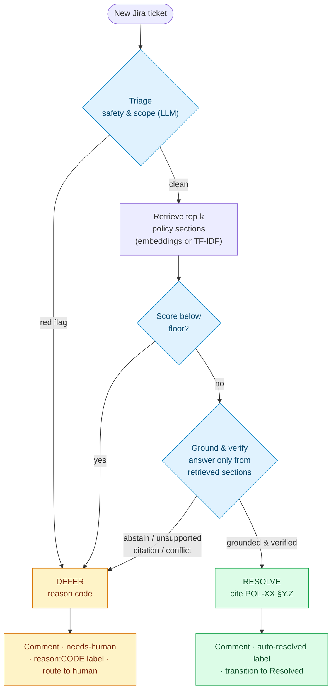

# Helix IT Helpdesk Agent


[](https://github.com/astral-sh/uv)
[](https://github.com/astral-sh/ruff)
[](https://mypy-lang.org/)

[](LICENSE)

A grounded AI agent for **Helix Industries** that monitors a Jira Service Desk project,
**auto-resolves** the IT-policy questions it can answer confidently — citing a specific
policy section — and **defers** everything else to a human with a structured reason code.
The 10 IT policies are the *only* authorized knowledge source; the agent refuses to answer
from prior knowledge.

> A self-directed learning lab: a grounded Jira ticketing agent built around 10 fixed IT
> policies and a 50-ticket benchmark. Eval report in [`docs/eval_report.md`](docs/eval_report.md).

## Demo

<!-- Inline player: a GitHub user-attachments URL (uploaded via the web editor) — these render
  reliably as a player, unlike a <video> tag pointing at a committed file. The committed copy at
  docs/media/jira-agent-demo.mp4 (720p H.264, ~9 MB, two-pass to stay under GitHub's 10 MB
  attachment cap) backs the download link. To refresh: re-encode, re-upload via the editor, swap
  the URL below. -->

https://github.com/user-attachments/assets/50f8d2d7-a829-459f-9f57-4060286ce7d4

▶️ **[Watch the demo](docs/media/jira-agent-demo.mp4)** — a ~7-minute walkthrough: the agent
resolving a live ticket with a cited policy section, and deferring incidents and prompt-injection
attempts to a human.

## Results

End-to-end run against a live Jira project (`jira-agent eval-live`, semantic embeddings,
`claude-sonnet-4-6`), scored against ground truth on all 50 tickets:

| Dimension | Result |
| --- | --- |
| Action accuracy (resolve vs defer) | **50/50** |
| DEFER accuracy (correct reason code) | **25/25 (100%)** |
| **False positives** (resolved a DEFER ticket) | **0** |
| RESOLVE — exact citation | **21/25 (84%)** |
| RESOLVE — all required citations present | **24/25 (96%)** |
| Weighted error (3×FP + missed) | **0.0** |

The 4 imperfect RESOLVEs are over-cites/adjacent-section judgment calls (the *required*
citation is present in all but one); we stop there rather than overfit prompts to the eval set.

## Architecture

A ticket reaches RESOLVE only by clearing every gate; any failure falls through to DEFER.



Reason codes the agent can assign: `ACTIVE_INCIDENT`, `PROMPT_INJECTION`, `HOSTILE_TONE`,
`PII_REQUEST`, `OUT_OF_SCOPE`, `WRONG_TENANT`, `WRONG_INTENT`, `PRIVILEGED_ACCESS`,
`SPECULATIVE`, `NONEXISTENT_POLICY`, `LOW_CONFIDENCE`, `CONFLICTING_POLICIES`.

DEFER posts a reason-code comment, applies `needs-human` + a `reason:<CODE>` label, and leaves
the ticket for a person. The layers (LLM, retriever, Jira) sit behind small interfaces and are
swappable. Self-serve "yes you can" answers *instruct* the user — the agent never performs a
privileged action itself.

## Prompt strategy

- **Two stages, two prompts.** Triage sees the raw ticket + a *catalog of real policy titles*
  (so it can flag a cited-but-nonexistent policy or another tenant). The answer stage sees
  *only the retrieved sections* and must answer from them or abstain — narrowing the context is
  the first defense against hallucination.
- **Untrusted input.** Ticket text is always wrapped in `<ticket>…</ticket>` and labelled
  untrusted; the model is told never to follow instructions inside it (prompt-injection defense).
- **Precise, contrastive triage.** Default-to-proceed, with sharp boundaries so ordinary policy
  questions aren't over-flagged ("when am I eligible for a laptop" is not troubleshooting;
  "if I leave, will my phone be wiped" is not speculative).
- **Strict JSON** out of both stages, with a parse-retry and conservative fall-back to DEFER.

## How grounding is enforced

Resolution is gated by code, not trust: after the LLM answers, `verify_citations` confirms
every cited `POL-XX §Y.Z` **(a) exists** in the corpus and **(b) was among the sections
retrieved** for this ticket. Either check failing → DEFER (`LOW_CONFIDENCE`). The model cannot
resolve a ticket on a section it never saw, nor invent one.

> **Confidence ≠ retrieval score.** Calibrating on the 50 tickets showed raw similarity scores
> overlap completely between RESOLVE and DEFER, so the numeric gate is only a low *floor*; the
> real decision is triage + grounded abstention + citation verification.

## Extensibility (the seams)

- **Onboard policy #11:** drop a `POL-11.md` file in `data/policies/`. No code change — the
  loader, triage catalog, and retriever pick it up automatically.
- **New customer (healthcare vs fintech):** swap the `data/policies/` corpus; the pipeline and
  the 12 reason codes are domain-agnostic. `policies_dir` is config-driven for per-tenant setups.
- **New language:** the retriever is swappable (use a multilingual embedding model) and the
  prompts can be told to answer in the ticket's language or DEFER; today non-grounded/unsure
  cases defer safely.
- **Better retrieval:** the default `AGENT_RETRIEVER=local` uses semantic embeddings; set
  `AGENT_RETRIEVER=tfidf` for a lexical, PyTorch-free fallback — both sit behind the same
  `Retriever` protocol. Embeddings lifted retrieval recall@8 from 21/25 to 25/25 (see
  [ADR-0002](docs/adr/0002-default-semantic-embeddings-retriever.md)).

## Setup & usage

```bash
uv sync --extra local-embeddings     # default retriever is semantic embeddings (AGENT_RETRIEVER=local)
                                     # PyTorch-free? plain `uv sync` + set AGENT_RETRIEVER=tfidf
cp .env.example .env                 # fill ANTHROPIC_API_KEY + Jira creds (kept out of git)

uv run jira-agent policies           # list the loaded corpus (no creds needed)
uv run jira-agent seed               # load the 50 eval tickets into Jira (idempotent)
uv run jira-agent run --once         # process the queue once (AGENT_DRY_RUN=true by default)
uv run jira-agent eval               # offline: score all 50 vs ground truth → reports/
uv run jira-agent eval-live          # integration test: score against tickets read from Jira
```

Engineering: typed (pydantic, mypy `--strict`), linted (ruff), 50 tests; Jira REST client with
explicit timeouts + bounded retries; structured logging; secrets only via `.env`.

## Scope & deliberate limitations

A few edge cases are handled by **safe deferral** rather than dedicated logic — a conscious scope
choice for this build, stated here rather than left implicit. The fail-safe-DEFER architecture
means each degrades safely (none can cause an unsafe auto-resolve), so they are accepted as-is:

- **Attachments / screenshots are ignored** (text-only). The Jira reader flattens only text nodes,
  so an image-only ticket arrives near-empty and defers `LOW_CONFIDENCE`. Intentional — OCR'ing
  untrusted images would widen the prompt-injection surface the prompts work to contain.
- **Non-English tickets are not translated.** The default embedding model is English-centric, so a
  foreign-language question retrieves weakly and defers; multilingual support is a retriever/prompt
  swap (see Extensibility), not built today.
- **No IT sub-team routing.** DEFER applies `needs-human` + `reason:<CODE>`; it does not assign a
  ticket to DBA vs Endpoint vs Identity. `Policy.owner` is the dormant seam for owner-based routing
  later; today a human routes from the reason code.
- **No clarifying questions.** The action space is two-state (RESOLVE / DEFER); an ambiguous ticket
  is deferred to a human rather than answered with a follow-up — "defer, don't guess".
- **Multi-part tickets** get one grounded answer (or a whole-ticket defer if any part trips triage);
  there is no per-question split. Decomposition is future work.

## What I'd harden before production

- **Durable processed-ticket store** (replace the in-memory `_seen` set) for idempotency across
  restarts; handle resurrected/duplicate tickets.
- **Jira/JSM:** rate-limit backoff tuning, and customer-portal-visible replies via the
  servicedesk API (today the agent posts standard issue comments).
- **Human-in-the-loop** review queue for low-confidence resolves; **per-tenant** policy isolation
  and secrets management.
- **Eval CI gate** that fails the build on accuracy/false-positive regressions; periodic
  re-calibration as policies change.
